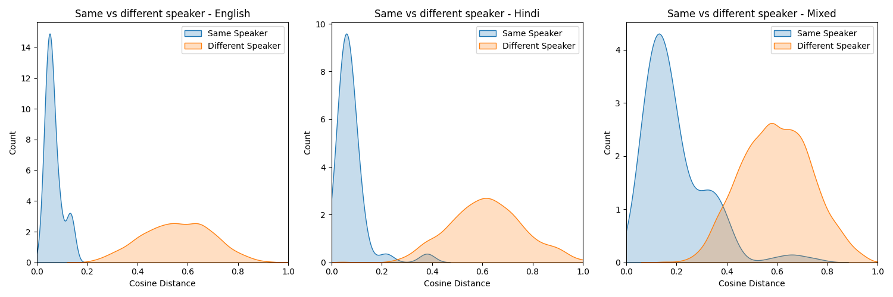

# Speaker Diarization Clustering

This project performs unsupervised speaker clustering using speech embeddings from the ECAPA-TDNN model. It includes two clustering approaches: Agglomerative Hierarchical Clustering (AHC) and Spectral Clustering (SC). The workflow includes preprocessing raw files, extracting embeddings, and clustering them to group audio segments by speaker.

---

## Dataset Overview

This dataset consists of 144 utterances collected from 36 children. Each child contributed 4 utterances — 2 in English and 2 in Hindi. For each language, the 2 utterances are different paragraphs taken from the same story, ensuring consistency in context and style within each language.

---

## Project Structure

```
├── data/
│   └── (input audio files and RecordingDetails.CSV)
├── .gitignore
├── README.md
├── eval.py
├── main.py
├── model_ahc.py
├── model_sc.py
├── preprocessing.py
├── requirements.txt
├── speaker_embedding.py
├── extract_embeddings.py
├── cosine_analysis.py
```

---

## Setup Instructions

### 1. Create Virtual Environment
```bash
mkdir data
#Paste data in this folder along with RecordingDetails.csv
python -m venv diar_env
source diar_env/bin/activate  # On Windows: diar_env\Scripts\activate
```

### 2. Install Dependencies
```bash
pip install --upgrade pip
pip install -r requirements.txt
```

---

### Preprocessing - Rename Files and save as wav

```bash
python preprocessing.py
```

---

### Run Clustering

```bash
python main.py \
    --project_dir '<path_to_project>' \
    --n_speakers 36 \
    --clust_name sc/ahc \
    --force_emb True/False \
    --language english/hindi/both
```

---

## Cosine Distance Analysis

The script `cosine_analysis.py` computes and compares cosine distances across six predefined subcategories based on speaker and language. It is used to evaluate the separability between groups of embeddings before clustering. This helps visualize how distinct or overlapping the speaker clusters are.

### Sample Output



---

## Results

|  Method  | Hindi (%) | English (%) | Both (%) |
|----------|-----------|-------------|----------|
|   AHC    |   **95.83**   |   **100.00**    |   82.64  |
| SC (mean)|   84.35   |   91.14     |   88.83  |
| SC (max) |   88.89   |   94.44     |   **93.06**  |

---

## Inference

- **AHC performs best** when clustering is limited to **a single language**.
- **Spectral Clustering outperforms AHC** in the **mixed-language setting**, handling cross-language separation more robustly.
- Across both methods, **English clustering outperforms Hindi**, likely due to the ECAPA-TDNN model being trained primarily on English-language data.

---

## Notes

- Embeddings are extracted using ECAPA-TDNN.
- Cosine distance is used for affinity calculations.
- Results may vary based on speaker diversity and utterance duration.
```
